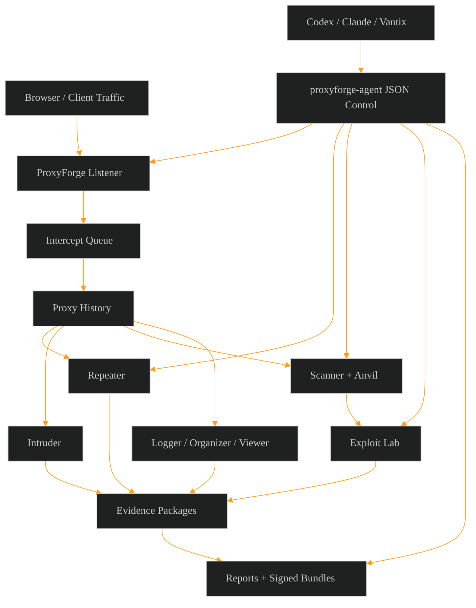

<p align="center">
  
</p>

<h1 align="center">ProxyForge v0.1.0-alpha.1</h1>

<p align="center">
  <strong>Cross-platform interception and mutation workbench for authorized web security testing.</strong>
</p>

<p align="center">
  
  
  
  
  
  
  
  
</p>

<p align="center">
  <a href="#quick-start">Quick Start</a> ·
  <a href="#skills--playbooks-roadmap">Skills &amp; Playbooks</a> ·
  <a href="#capabilities">Capabilities</a> ·
  <a href="#current-features">Features</a> ·
  <a href="#agent-control-surface">Agent Control</a> ·
  <a href="#headless-ci">Headless CI</a> ·
  <a href="#verification">Verification</a> ·
  <a href="#safety-boundary">Safety</a>
</p>

<p align="center">
  
  
  
</p>

---

## What is ProxyForge?

ProxyForge is a desktop workbench for authorized web security testing — internal review, bug bounty, agent-driven assessment, repeatable evidence collection.

The loop:

```text
intercept traffic → mutate requests → validate behavior → package evidence
```

Operational traffic, tokens, cookies, keys, callbacks, raw requests, raw responses, and exploit/replay material stay full-fidelity during execution. Redaction happens in report/export flows so testing is accurate and deliverables are safe.

---

## Open-Source Alpha Candidate Status

**`0.1.0-alpha.1` — Source alpha candidate.**

The source tree is ready for public alpha review. Create or publish the source alpha tag only after the GitHub source gate records `npm run test:ci:fast` passing for the exact commit with Playwright Chromium installed. Unsigned binaries can be built for validation, but they are not release-certified public installers until native artifact receipts and `npm run release:preflight` pass for the exact release tag.

- `npm run build` — React/Vite renderer + Electron runtime.
- `npm run docs:pages` — static GitHub Pages documentation build in `.gitignored/github-pages` for `gh-pages` publishing.
- `npm run release:fuses` and `node tests/electron-fuse-policy.mjs` — Electron fuse policy and packaged-artifact verification contract.
- `npm run test:ci:fast` — required GitHub source gate before publishing the public alpha tag; CI installs Chromium with `npx playwright install --with-deps chromium` first.
- Linux: AppImage + `.deb`. Windows: NSIS installer + portable. Native artifact receipts are produced by the GitHub release matrix for the exact release commit/tag before broad installer distribution.
- `npm run release:preflight` — required binary certification guard after live validation, native smoke, fuse, packaged-license, SHA-256, and release artifact evidence are collected.
- Headless: `proxyforge headless` + `proxyforge-agent` CLI.
- License: MIT. Authorized-use language is the project safety policy, not a license restriction.

Release notes: [`docs/RELEASE_NOTES_v0.1.0-alpha.1.md`](docs/RELEASE_NOTES_v0.1.0-alpha.1.md). Hotfix process: [`docs/HOTFIX_PROCESS.md`](docs/HOTFIX_PROCESS.md). Feature and gate status: [`docs/FEATURE_MATRIX.md`](docs/FEATURE_MATRIX.md).

---

## Skills & Playbooks Roadmap

The core engine, scanner check families, Anvil authoring surface, and `proxyforge-agent` control wrapper ship in alpha-1. The next milestone is the corpus: large, signed, traceable skill / playbook / Anvil libraries adapted from the sibling research catalog.

| Track | Target | Status | Source |
| --- | ---: | --- | --- |
| Skills (active testing checks) | **100+** | In progress | [`the-vibe-dev/sechive`](https://github.com/the-vibe-dev/sechive), rewritten as native TypeScript modules |
| Playbooks (multi-step workflows) | **50+** | In progress | Vantix research workspace, mapped into Automations / Agent control |
| Anvil rule libraries | **30+** | In progress | Authored against the Anvil authoring surface + signed community packs |
| Signed extension packs | **10+** | Roadmap | Published through the signed update flow with operator-reviewed permissions |

Every track lands as **signed, project-policy-aware packages** — not silent runtime imports. Skills carry source metadata, oracle classifiers, payload mutations, and fixture validation. Playbooks carry scope/throttle/approval bindings. Anvil libraries carry digest, signer trust, fixture status, and reusable variables. None of this is a runtime dependency on Vantix or SecHive — see [`source-reference/vantix/README.md`](source-reference/vantix/README.md) for the per-module porting mapping.

Tracked in [`docs/PROXY_FORGE_ROADMAP.md`](docs/PROXY_FORGE_ROADMAP.md) and [`docs/PROXY_FORGE_MASTER_PLAN.md`](docs/PROXY_FORGE_MASTER_PLAN.md).

---

## Capabilities

Counts come from `src/types.ts`, `package.json`, and the feature catalog below. Run `scripts/count_proxyforge_assets.py` from a repo checkout to refresh live registry counts before tagging a release.

| Count | Value | Basis |
| --- | ---: | --- |
| Workbench / UI surfaces | 20 | Dashboard, Target Map, Proxy, Repeater, Intruder, Scanner, Exploit Lab, Automations, AI, Logger, Organizer, Search, Viewer, Sequencer, Decoder, Comparer, OAST/Collaborator, Extensions, Reports, Settings |
| Current feature lanes | 35 | See [Current Features](#current-features) |
| AI providers | 3 | Codex, Claude, OpenAI-compatible local endpoints |
| Agent control flows | 9 | `proxyforge-agent` lanes for MITM, replay, scanner, callback, exploit, report, search/view, Chromium/data collection, suggested actions |
| Scanner check families | 7 | Security headers, CORS, cache-key, OPTIONS, auth-state comparison, JWT, GraphQL introspection |
| Intruder modes | 4 | Sniper, Battering Ram, Pitchfork, Cluster Bomb |
| Report / CI export formats | 6 | Markdown, HTML, JSON, PDF, SARIF, JUnit |
| Verification commands | 21 | See [Verification](#verification) |
| Skills (planned) | **100+** | Adapted from the sechive corpus |
| Playbooks (planned) | **50+** | From the Vantix research workspace |
| Anvil libraries (planned) | **30+** | Authored + community-signed |

---

## Current Features

- Cross-platform Electron shell with a Vite/React renderer.
- 20-tool analyst UI: Dashboard, Target Map, Proxy, Repeater, Intruder, Scanner, Exploit Lab, Automations, AI, Logger, Organizer, Search, Viewer, Sequencer, Decoder, Comparer, OAST/Collaborator, Extensions, Reports, Settings.
- Proxy HTTP history table with saved filter-sets, HTTP/2-aware metadata summaries, multiplexed stream grouping, annotation lanes, request/response inspectors, issue triage panel, durable Repeater/Scanner/Reports handoff packages, and saved traffic comparison packages.
- Electron IPC bridge for starting/stopping a local HTTP proxy listener.
- HTTP proxy engine for absolute-form requests + CONNECT tunnel success/failure metadata capture.
- HTTPS inspection with per-project root CA isolation, per-host certificates, root rotation/revocation, upstream TLS validation modes, CONNECT MITM, agent-visible project-CA/TLS status, socket-backed decrypted capture/failure evidence packages, and a Settings UI for certificate export/trust.
- HTTP listener capture packages with method/status counts, raw byte totals, body-capture proof, operational-secret preservation, and a bidirectional intercept queue with forward, drop, edit-before-forward, and reviewable decision lanes.
- Match/replace rules for request, response, and WebSocket traffic with matched-rule review and before/after deltas.
- WebSocket tunneling with bidirectional frame history, full-fidelity capture packages, binary decoding, per-direction frame intercept/edit/drop/forward, frame rewrite rules, sequence anomaly clustering, active sequence fuzzing, close-code analytics, filterable state graphs with export, multi-connection clustering, state-machine diffing, side-by-side replay deltas, transcript export/import, per-message issue promotion, saved connection notebooks, saved replay collections, live-connection replay, and a frame viewer.
- Project snapshot persistence (Electron + browser-preview), plus explicit `.proxyforge.json` import/export for handoff and restore.
- Managed browser launch for Linux/Windows capture with isolated profiles, proxy routing, Chromium/Firefox cookie extraction, Chromium AES-GCM cookie decryption (Windows DPAPI + Linux Secret Service / safe-storage fallbacks), reusable session profiles with live refresh and `Set-Cookie` merge, and handoff into Target/Repeater/Scanner/crawl-audit/headless CI.
- Browser-powered client-side analysis: DOM source/sink inventory, fetch/XHR/WebSocket/storage instrumentation, client-side route + source-map discovery, web-message replay, prototype pollution source/gadget scans, and DOM evidence promotion into Reports.
- Target site map with URL tree and crawl path views, explicit scope gates, display filters, issue/activity overlays, content discovery handoffs, technology and parameter inventory, access-control review lanes, saved site-map comparison packages, crawl exchanges added to HTTP history, and Reports handoff.
- Repeater workspaces with tabbed/grouped views, import/exportable request libraries, per-tab diff history, snapshots, grouped batch sends, scoped replay IPC, deterministic browser-preview replay, saved request collections, session profile injection, bulk replay, authorization matrices, socket-backed per-send redirect/connection/timeout controls, replay history, pinned response snapshots, browser-powered desync/smuggling and parallel-race planning, connection-level timing evidence, replayable proof bundles, report promotion, and Comparer handoff.
- Intruder payload runner with Sniper, Battering Ram, Pitchfork, and Cluster Bomb modes, dry attack-mode expansion matrices, payload transformation matrices, multiple payload sets, saved attack configurations, payload generators, attack queue state, payload processors, recursive payload rules, grep/extract preset libraries, resumable checkpoint slices, resource-pool controls, streamed chunks, bounded result windows, memory-pressure telemetry, result comparison, result clustering, statistical/outlier ranking, payload-position diffing, scanner issue promotion, scope gating, sequential throttling, and browser-preview simulation.
- Passive scanner findings generated from recorded/replayed exchanges with dedupe and confidence summaries.
- Active scanner runner with scope gating, per-run throttle/max-probe limits, selectable check packs, security-header / CORS / cache-key / OPTIONS-method / authenticated-state / JWT-claim / GraphQL introspection checks, audit-trail exchanges, findings, check-pack evidence packages, full-fidelity raw probe samples, and report-export-only redaction.
- Scanner audit queue with persisted queue states, issue status/assignee/triage notes, remediation handoff, retest workflows, retest evidence-delta packages, insertion-point coverage review, active insertion-point review, authenticated-state matrix packaging, replay-derived check packages, configurable confidence/severity rules, report integration, and CI/report handoff metadata.
- Anvil custom scan-check authoring with plain-text `.anvil` definitions, reusable rule libraries, positive/negative fixture validation, custom-only headless execution, signed package review, evidence packages, source-agent execution/export, and Scanner/Reports handoff.
- Crawl-derived insertion-point audit runner that schedules active scanner checks across discovered query/form/path candidates, preserving duplicate/out-of-scope review, active-Scanner handoff evidence, raw probe samples, operational secret signals, and report-export-only redaction.
- Exploit Lab with PoC templates, non-destructive payload previews, saved multi-step chains, callback-assisted validations, portable exploit chain packages, package review/import with digest verification, side-by-side chain comparison, report-ready packages, scope checks, approval-gated validation, stop-on-proof logs, evidence exchanges, issue creation, and Repeater staging.
- Automation workbench with recorded macros, scheduled workflows, persisted scheduler queue/lease/heartbeat/receipt state, scoped execution logs, generated evidence, runner policy binding status, GitHub Actions/GitLab CI/Azure Pipelines/Jenkins export presets, headless extension execution evidence packages, and a real cross-platform headless scanner CLI that crawls, runs active checks, audits insertion points, writes reports, and returns CI failure codes.
- Logger workbench with all tool-generated HTTP traffic, live per-tool capture controls, pinned capture presets, import/exportable capture and archive-mapping preset libraries, tool/source filters, modified-message markers, sandbox-reviewed custom column script templates, blocked-token diagnostics, sample-output review packages, timing/body-size/cookie/path/content-type/JSON helper APIs, large-table custom column profile packages, raw HTTP/HAR/legacy proxy XML archive import/export, source-specific import normalization templates, per-import field mapping previews, archive conflict merge strategies, persisted import-job history with reviewer notes, timeline filters, batch replay, report attachment controls with signed provenance manifests, and handoffs to Viewer, Repeater, Organizer, and Reports.
- Organizer workbench with persistent message collections, notes, status/highlight tracking, reviewer assignment, reviewer SLA dashboarding and export, passphrase-encrypted and HMAC-signed collection package export/import, signed-package trust policy presets, signature-aware package diff/merge review, cross-project conflict merge modes, package conflict audit trails, CSV export, share-link digest generation, and handoffs into Viewer, Repeater, and Reports.
- Structured project search over request/response metadata and bodies — status/risk ranges, evidence predicates, negation, OR queries, semantic/similar ranking tokens, optional provider score merging, full-fidelity operational semantic corpus export, saved hunts (authz boundaries, secrets/tokens, GraphQL, CORS/cache, static route leaks, replay evidence), and handoffs to Viewer/Repeater/Decoder/Comparer.
- Viewer workbench with raw HTTP, pretty JSON, HTML, JWT, GraphQL, image, binary hex, and WebSocket frame views, persistent evidence pins, source-aware decoded/raw snapshots, and report-ready replay comparison exports.
- Sequencer token analyzer with live/manual capture, token-location extraction, larger-sample reliability gates, statistical test families, visual bit/character charts, profile comparison, export packages, entropy estimates, collision checks, repeated-prefix detection, bit-balance scoring, character-set inventory, and verdict findings.
- Decoder workbench with Base64/Base64url, URL, HTML, hex, binary, octal, JSON, JWT, SHA-1/SHA-256, canonicalization transforms, transform-chain history, smart decode detection, recursive recipes, JWT/JWS editing with local HS256 signing preview, JWE metadata preservation, binary/hex inspection, hash/encoding analysis, and import/exportable transform libraries.
- Comparer workbench with editable side-by-side inputs, request/response and replay loaders, whitespace-aware line diffing, similarity/change stats, unified diff output, saved comparison workspaces, evidence-linked replay/baseline delta handling, report-ready diff packages, whitespace-tokenized word diffs, byte-level edits, synchronized result review, Text/Hex switching, structured HTTP diffs, binary/hex comparison, normalization presets, saved comparison libraries, and Reports handoff.
- OAST workbench with persistent interaction workspaces, DNS/HTTP/SMTP payload generation, payload ownership tracking, live backend listener profiles (browser-preview + local DNS/HTTP/SMTP), signed interaction polling, scanner and Exploit Lab correlation replay packages, payload lifecycle review, finding promotion, Repeater staging, and CI/report-ready interaction packages.
- Extensions workbench with a curated catalog, local manifest loading, signed package manifest review with digest/trust status, signed update-channel policy, sandboxed API hooks for request/response processing, editor tabs, scanner checks, and headless runners, dependency/version policy review, compatibility fixtures, runtime policy status, enabled/disabled state, health telemetry, run logs, traffic mutation and replay APIs, issue creation, evidence handoffs, and import/exportable extension policy presets.
- AI provider configuration for Codex, Claude, and OpenAI-compatible local endpoints — full-fidelity execution context bundles, desktop CLI/HTTP runner IPC, prompt templates, streaming transcript telemetry, provider/estimated usage source tracking, model-specific prompt evaluation, saved/importable/exportable evaluation baselines, cross-provider prompt/version comparisons, benchmark-set replay against saved projects, persisted run history, token/cost accounting, browser-preview planning fallback, controlled suggested-action execution packages, and the `proxyforge-agent` JSON control wrapper.
- Report builder with section selection, executive/technical appendices, remediation-plan tables, affected asset inventory, finding/evidence curation filters, evidence coverage mapping, evidence attachment manifests, verification/signature metadata, governance attestation for active signed policy status, runner binding and approval gate summary, export readiness checks, full report package import/export/preview, Markdown/HTML/JSON/PDF export, branded signed evidence-bundle export, verification display, merge/conflict review before project import, built-in and portable custom operator report templates, redacted evidence attachments, Electron print-to-PDF rendering, desktop report files, and browser-preview artifacts.
- Project safety policy with editable scope allowlist, active-runner scope preflight, throttle floors, per-run request caps, per-user policy overrides, signed enterprise governance policy package import/review/activation, runner policy bindings for Automations/Scanner/Exploit Lab/CI-headless execution, role-scoped operator approval review, configurable SSO-backed operator identities, import/exportable team policy handoff, remote policy pull/push transport, surfaced policy status, remote audit-retention queueing, approval records for gated validation, signed audit exports with governance metadata, persisted audit events, and report-phase secret redaction.
- Browser fallback mode with seeded traffic and simulated capture for UI development.

---

## Architecture Overview



---

## Quick Start

Download the latest release for your OS from the releases page.

### Windows

```text
ProxyForge Setup 0.1.0-alpha.1.exe   (installer)
ProxyForge 0.1.0-alpha.1.exe         (portable)
```

The alpha binary is unsigned. SmartScreen will warn — use **More info → Run anyway**.

### Linux Debian / Ubuntu

```bash
sudo apt install ./proxyforge_0.1.0-alpha.1_amd64.deb
```

### Linux AppImage

```bash
chmod +x ProxyForge-0.1.0-alpha.1.AppImage
./ProxyForge-0.1.0-alpha.1.AppImage
```

On first launch the **setup wizard** walks through naming a project, defining scope, generating the project root CA, starting the listener, and configuring a browser. Re-open it any time via the **Setup** button in the top bar, or trust the root CA manually via **Settings → Project CA**. Point a browser at `127.0.0.1:8080`, or use **Launch Managed Browser** for an isolated profile wired to the proxy.

Full install notes, SmartScreen / antivirus walkthroughs, browser-specific CA trust steps, headless CLI reference, and SHA-256 verification live in [`docs/INSTALL_LINUX_WINDOWS.md`](docs/INSTALL_LINUX_WINDOWS.md).

---

## Headless CI

```bash
npm run headless -- --target https://app.example.test \
  --scope app.example.test \
  --crawl-audit \
  --report json,bundle \
  --sarif \
  --junit \
  --out-dir ci-artifacts/proxyforge \
  --fail-on high
```

```bash
proxyforge headless --project-file retail-api.proxyforge.json \
  --project-exchange hx-1032 \
  --report json,bundle \
  --sarif
```

Authenticated scans use environment-backed secrets:

```bash
PROXYFORGE_AUTHORIZATION="Bearer $TOKEN" \
PROXYFORGE_COOKIE="session=$SESSION_ID" \
proxyforge headless --target https://app.example.test --scope app.example.test --report json,bundle --sarif
```

The CLI accepts `--config proxyforge-headless.json`, replays from exported `.proxyforge.json` project files, honors project scope, applies authenticated session profiles from config / `--header` / `--cookie` / env vars (`PROXYFORGE_AUTHORIZATION`, `PROXYFORGE_BEARER_TOKEN`, `PROXYFORGE_API_KEY`, `PROXYFORGE_COOKIE`, `PROXYFORGE_SESSION_HEADERS`), writes `proxyforge-headless-summary.json`, exports report artifacts through the same redacting report engine as the desktop app, emits `proxyforge-results.sarif` and `proxyforge-junit.xml` for CI ingestion, and exits with `1` for blocked scans or `2` when `--fail-on` is met.

---

## Desktop Release Verification

```bash
npm run test:release
npm run dist:linux
npm run dist:win
npm run dist:win:zip
```

`npm run test:release` builds the renderer and Electron runtime, then checks Electron Builder targets, packaged entrypoints, ignored release directories, and the operator checklist. Linux targets AppImage and `.deb`. Windows targets NSIS and portable executables. `dist:win:zip` is the Linux-host fallback when Wine is unavailable. The install-smoke procedure lives in [`docs/RELEASE_CHECKLIST.md`](docs/RELEASE_CHECKLIST.md); artifact evidence is in [`docs/RELEASE_EVIDENCE.md`](docs/RELEASE_EVIDENCE.md).

---

## Agent Control Surface

`proxyforge-agent` is a JSON control wrapper over IPC for Codex, Claude, Vantix, and OpenAI-compatible local endpoints. Nine control lanes:

- persistent MITM logging
- replay
- scanner
- callback / OAST
- exploit validation
- report generation
- search / view
- Chromium / data collection
- controlled suggested-action execution

Redaction is limited to report/submission exports so agents work with full-fidelity runtime context while final artifacts stay safe. Full IPC contract and lane catalog: [`docs/AGENTIC_INTERFACE.md`](docs/AGENTIC_INTERFACE.md).

---

## Browser-Powered Client-Side Analysis

Evidence that only appears after JavaScript executes in an authenticated browser session.

- Source/sink inventory records DOM, URL, storage, cookie, message, and script-derived sources alongside navigation, execution, and rendering sinks.
- Instrumentation captures fetch, XHR, WebSocket, storage, history, postMessage, and DOM mutation events so client-side behavior is searchable, replayable, and linked back to the originating page state.
- Route and source-map discovery expands the Target map with client-side routes, bundled modules, sourcemap-derived functions, and hidden API calls found during browser execution.
- Web-message replay resends captured `postMessage` payloads with controlled origin, frame, and route context while preserving scope and policy checks.
- Prototype pollution checks trace controllable sources into merge, path-setter, and gadget candidates, recording whether a candidate is theoretical, reaches a gadget, or produces report-ready proof.
- DOM evidence promotion converts selected source/sink paths, replay results, polluted-gadget traces, screenshots, and browser event timelines into report attachments with redaction and provenance metadata.

---

## Proxy — Intercept & History

- HTTP history filtering on scope, host, method, status, MIME, tool source, transport, modified state, annotations, issue state, reviewed state, and saved capture presets. Filter-set packages preserve saved predicates, facets, annotation lane counts, raw request/response samples, and operational secret signals until report export. HTTP/2 reports preserve pseudo-headers, ALPN/h2c hints, stream ids, multiplexed authority buckets, trailers, warning counts, and downgrade/proxy-chain review notes. Cross-tool handoff packages preserve Repeater raw requests, Scanner candidates with insertion/check hints, Reports attachment fingerprints, stable exchange ids, and executor secrets.
- HTTP/2-aware metadata summaries record protocol version, stream identity, TLS/ALPN hints, timing, size, direction, CONNECT tunnel context, and header/body risk notes alongside the request/response inspectors.
- Intercept and match/replace rule review exposes queued decisions, matched rules, before/after deltas, disabled/policy-blocked rules, exported intercept evidence packages, importable/exportable rule-library packages, large-rule warnings, and reviewer notes before modified traffic is promoted as evidence.
- Capture preset handoff sends filtered traffic slices to Logger, Target, Repeater, Scanner, Comparer, Organizer, and Reports while preserving scope, redaction, source, and operator context.
- Annotation lanes add status, highlight, owner, notes, finding, and retest markers to history rows so manual triage moves without leaving the Proxy workbench.
- Promotion workflows stage selected requests for Repeater replay, Scanner active checks, saved traffic comparison packages, and report-ready evidence attachments with original/modified exchange provenance intact.

---

## Target — Site Map

- URL tree and crawl path views switch between normalized host/path hierarchy and the route sequence that discovered each node, preserving source exchanges, browser events, depth, auth/session context, and scope decisions.
- Display filters cover scope, status code, MIME, method, parameter presence, technology, issue severity, activity state, discovery source, and reviewed/unreviewed nodes.
- Issue and activity overlays surface passive/active findings, crawl progress, newly discovered nodes, replay/scanner touches, manual notes, and stale or failed fetch states directly on the site map.
- Content discovery handoffs queue and execute focused wordlist, link, script, route, and hidden-API discovery from selected hosts/paths while carrying the same scope, throttle, session/header, and policy context as the main crawler.
- Technology and parameter inventory records observed frameworks, server hints, client-side bundles, content types, query/form/JSON/GraphQL/cookie/header parameters, and insertion-point ownership for follow-on scanning or manual review.
- Access-control review lanes compare baseline and alternate-session visibility across selected nodes, identify unauthenticated or role-specific deltas, and hand candidate requests to Repeater, Scanner, and Comparer with source-map context intact.
- Saved site-map comparison packages preserve two map snapshots, normalization rules, added/removed/changed node summaries, status/MIME/method/host/parameter/authz-sensitive deltas, affected parameters, inventory deltas, issue deltas, reviewer notes, redaction state, agent command output, and report-ready attachments.
- Reports handoff exports affected URL inventories, discovery coverage, technology/parameter summaries, role-based access-control deltas, site-map comparisons, and selected evidence references into technical appendices and signed evidence bundles.

---

## Repeater — Desync & Race

Connection-level proof, not blind high-volume probing. Scoped to authorized targets.

- Attack planning records CL.0, client-side desync, pause-based desync, request-smuggling, parser-differential framing hypotheses, and parallel-race hypotheses with scope, host, transport, request template, safety limits, and expected confirmation signals.
- Grouped send modes cover sequence on a single warmed connection, sequence across separate connections, and synchronized parallel sends for race-condition testing.
- Timing evidence captures last-byte sync, single-packet/near-simultaneous dispatch intent, connection warming, jitter, response ordering, status/body deltas, and tunnel/proxy metadata.
- Replayable proof bundles preserve the request group, send mode, connection plan, timing ledger, normalized responses, redaction state, and operator notes so another reviewer can rerun or audit the proof.
- Report promotion turns confirmed desync, smuggling, and race evidence into findings with affected endpoints, risk summary, reproduction steps, timing artifacts, and signed provenance metadata.

---

## Scanner — Verification & Retest

Audit-sidecar workflow around findings, insertion points, rules, and report evidence.

- Retest workflows start from an existing scanner issue, replay the original proof request with the same scope, session, throttle, and check-pack context, and record whether the finding is still present, fixed, regressed, blocked, or inconclusive. Retest evidence-delta packages preserve the baseline exchange, retest exchange, operator, timestamp, runner policy binding, request edits, raw operational secret signals, outcome history, report attachments, and report-export-only redaction.
- Active check-pack evidence packages preserve supported/unsupported check accounting, all built-in check families, scope/rate/cap controls, authz comparison legs, dedupe/confidence metadata, raw probe exchanges, operational secret signals, and report-export-only redaction.
- Insertion-point coverage review compares crawl-discovered query, form, path, header, cookie, JSON, GraphQL, and replay-derived candidates against the active checks that touched them. The review exposes untested candidates, skipped candidates with reasons, duplicate/merged candidates, and candidates excluded by scope or policy.
- Crawl audit insertion evidence packages preserve crawler-derived query/form/path coverage, duplicate merge accounting, out-of-scope skips, active-Scanner handoff, raw probe samples, operational secret signals, and report-export-only redaction before findings move to report export.
- Active scan package workflow builds scoped plans from the selected check pack, reviews crawler and replay-derived insertion points, compares baseline and alternate authenticated states, packages replay-derived scanner checks, and attaches a report-ready evidence package with CI/headless command metadata, attachment manifests, active/suppressed finding status, full-fidelity raw samples, and report-export-only redaction.
- Confidence and severity rules are configurable per project and per scan profile. Rules raise, lower, suppress, or require review for issue classes based on check result strength, authenticated-state comparison, callback proof, affected asset criticality, response evidence, and repeated confirmation across retests.
- Report-ready evidence deltas compare original proof, latest retest, and prior retests to label findings as fixed, regressed, still vulnerable, or inconclusive. `proxyforge-scanner-retest-evidence-delta-package` artifacts are available to agents through `scanner-retest` and `scanner-evidence-export`. Active scan evidence packages add the scan plan, insertion-point review, authenticated-state matrix, replay-derived checks, affected exchange IDs, CI command, and report-ready summary for executive summaries, technical appendices, SARIF/JUnit, and signed evidence bundles.

---

## Anvil — Custom Scan Checks

Anvil is ProxyForge's first-party authoring surface for project-specific custom scan checks. Checks are treated as scanner assets with reviewable metadata, reproducible fixtures, and report-aware evidence output. They live outside the Extensions runtime.

- Custom checks are authored as plain-text `.anvil` definitions with metadata, issue templates, request mutations, response matchers, confidence/severity defaults, tags, and reusable variables.
- Rule libraries group related checks for a target class, program, or team policy. Libraries are importable/exportable, versioned, signed when shared, and reusable across desktop Scanner runs and headless CI scans.
- Fixture validation runs checks against saved request/response exchanges before they are enabled. Fixture results show expected matches, unexpected matches, syntax issues, matcher coverage, and any issue fields that would be reported.
- Headless execution packages approved definitions with scope, rate, session, and policy context so CI runs the same custom checks as the desktop Scanner and emits machine-readable results.
- Signed package review records package digest, signer/trust status, requested scanner permissions, library contents, fixture status, and operator approval before a shared rule library becomes active.
- Anvil evidence packages preserve the `.anvil` source, reusable library content, fixture validation, headless custom-only run, signed package review, Scanner finding handoff, Reports attachments, raw samples, operational secret signals, and report-export-only redaction. Agents drive the same flow with `anvil-plan`, `anvil-run`, and `anvil-package-export`.
- Scanner and Reports handoff turns custom-check matches into normal findings with source definition metadata, fixture/headless run provenance, redaction state, remediation text, and evidence attachments.

---

## Sequencer — Token Analysis

Proving token unpredictability with enough sample context, extraction metadata, and reproducible statistics for a reviewer to trust the conclusion.

- Live capture collects tokens from selected proxy traffic and manual paste/import lanes while preserving token source, extractor, timestamp, request/response location, and project scope. The corpus is reusable for repeated statistical runs and report handoff.
- Token-location extraction records whether values came from cookies, headers, query parameters, JSON bodies, HTML forms, redirects, JavaScript storage, or operator-supplied samples so weak-token findings point back to affected application behavior.
- Larger-sample management tracks sample size, uniqueness, duplicates, collection rate, required thresholds, warning states, and confidence notes before statistical verdicts are treated as reliable.
- Statistical test families cover entropy estimates, collision frequency, repeated prefixes/suffixes, character distribution, bit balance, bit transitions, byte/character position bias, serial correlation, and printable alphabet coverage.
- Visual analysis: bit-level heatmaps, per-character distribution charts, position-bias views, collision timelines, sample-quality summaries.
- Profile comparison compares token generators, environments, user roles, sessions, or before/after remediation samples and preserves deltas as evidence.
- Export and Reports handoff produces redacted sample manifests, statistics summaries, chart snapshots, extractor metadata, reliability notes, and report-ready weak-token findings.

---

## Decoder — Transformations

Turn unknown or layered values into repeatable, auditable transform recipes that move between traffic, Decoder, Repeater, Viewer, and Reports without losing source context.

- Smart decode detection identifies URL, HTML, Base64/Base64url, hex, binary, octal, JSON, JWT/JWS, JWE, and nested encoding layers, recording confidence, byte/text assumptions, hashes, and encoding-risk notes.
- Recursive transform recipes save, replay, apply, and export decode/encode/hash/canonicalization steps while preserving inputs, outputs, errors, timestamps, and the current value preview.
- JWT/JWS workflows support safe local editing of headers, claims, and serialized segments with local HS256 signing preview for authorized replay testing. JWE workflows preserve encrypted compact-token metadata and clearly flag the key-backed review boundary.
- Binary and hex inspectors expose byte offsets, printable text, ASCII/UTF-8 previews, null/high-byte counts, and digest metadata so payloads are inspected without forcing lossy conversion.
- Hash and encoding analysis inventories candidate encodings, SHA-1/SHA-256 digests, lengths, printable ratios, entropy-like signals, and canonicalization differences.
- Transform libraries are import/exportable, reviewable, and report-aware, carrying recipe metadata, smart-analysis runs, JWT workspaces, binary inspections, digest previews, and handoff artifacts.

---

## Comparer — Diff

Compare two items from traffic, Repeater, Viewer, saved project artifacts, or paste/import sources.

- Word mode tokenizes text by whitespace for readable content changes. Byte mode preserves byte-level edits for binary payloads, exact protocol bodies, and lossy-text edge cases.
- Result review keeps synchronized side-by-side panels, Text/Hex view switching, binary/hex comparison, and structured HTTP sections for request/status lines, headers, parameters, form fields, cookies, and bodies.
- Normalization presets reduce expected noise from headers, form fields, whitespace, MIME type, and text-only response filtering, with baseline/candidate request matching for access-control review.
- Saved comparison libraries, replay/baseline delta review, evidence attachments, and Reports handoff preserve source references, normalization settings, redaction state, reviewer notes, and report-ready diff packages.

---

## OAST — Live Backend

Live interaction backend surface in addition to browser-preview polling. In Electron mode, listener profiles start local HTTP, UDP DNS, local SMTP, or hybrid local collection with host, public base URL, port, poll interval, retention, signing key, and CI provider metadata.

- The Electron callback listener service captures matched interactions through real local sockets and exposes IPC/preload/native bridge hooks for UI polling.
- Signed poll batches preserve payload ids, new interaction ids, scanner issue correlation, Exploit Lab run correlation, workspace links, HMAC-SHA256 metadata, and report-ready status.
- Correlation replay packages inject callback endpoints back into source requests for Repeater staging, scanner issue promotion, exploit validation replay, and Reports evidence handoff.
- Payload lifecycle reviews separate observed, waiting, archived, stale, and archive-candidate payloads while preserving retention controls and signed raw evidence.
- CI handoff packages emit provider-specific `proxyforge oast poll` commands, environment bindings, payload ids, interaction ids, and package JSON for report or pipeline artifacts.

---

## Extension Runtime Policy

The Extensions runtime is a sandboxed API layer — not just catalog/manifest management. The contract covers hooks for request and response mutation, custom editor tabs, passive and active scanner checks, replay/headless execution, issue creation, and evidence handoff into reports.

Local manifests declare a constrained `runtimeApi` action list for supported hooks. The sandbox executes request/response header mutation, traffic tags, notes, editor-tab metadata, and scanner issue creation only when the installed extension has the required permissions. Unknown capabilities and under-scoped actions are denied before side effects and recorded in the extension run log.

Extension packages surface dependency and version policy review before activation: package digest, signer/trust status, requested hook permissions, compatible ProxyForge API version, and blocked/stale dependency state. Runtime surfaces show whether an extension is active under the current project policy, disabled by operator choice, blocked by dependency/version policy, or blocked by enterprise governance.

Headless CI runs that execute extensions emit an evidence package tying extension manifest digests, runtime policy status, hook execution logs, generated scanner issues, request/response mutations, and report attachments back to the project policy and CI run metadata.

### Signed Extension Update Flow

Signed updates are treated as a policy-reviewed supply-chain event, not a silent background refresh. Each catalog or private feed update publishes a signed manifest containing the extension id, previous and candidate versions, compatible ProxyForge API range, package digest, signer identity, timestamp, changelog URL, dependency delta, and requested permission delta. ProxyForge reviews that manifest against the active trust store and project/enterprise policy before downloading or activating.

1. Discover update metadata from the configured catalog, local feed, or team policy package.
2. Verify the update manifest signature, signer trust chain, manifest freshness, and extension id/version continuity.
3. Fetch the candidate package by digest, verify the archive digest, and compare its declared permissions, dependencies, and API compatibility against the installed package.
4. Run compatibility fixtures and migration checks before activation: saved request/response hook samples, editor-tab fixtures, scanner-check fixtures, replay/headless fixtures, policy-denial fixtures.
5. Present operator review when the signer, permissions, dependencies, compatibility status, or governance policy requires approval.
6. Activate the update atomically. Keep rollback metadata for the prior version. Write an update audit record with manifest digest, package digest, signer, operator, policy decision, and fixture results.

Blocked or deferred updates leave the existing enabled version in place unless policy requires disabling it. Runtime surfaces distinguish `update available`, `update blocked by signature`, `update blocked by compatibility`, `update requires approval`, `update staged`, `rollback available`, and `rollback required by policy`.

### Compatibility Fixtures

Compatibility fixtures are a durable regression harness as the sandboxed API evolves. Fixtures are versioned with the extension SDK and cover request/response processing, custom editor tabs, passive scanner checks, active scanner checks, replay/headless runs, traffic mutation, issue creation, evidence handoff, and policy-denied operations. Each fixture includes the input exchange, expected hook calls, allowed side effects, expected issues/evidence, required permissions, and API version constraints.

The fixture runner executes in desktop and headless modes, produces machine-readable results for CI, and attaches fixture summaries to extension update reviews. Failures are grouped by breaking API change, missing permission, unsupported legacy extension API surface, dependency/runtime mismatch, and behavior drift.

### Runtime Diagnostics

The Extensions workbench exposes lifecycle state, sandbox health, API version negotiation, policy decision, signer/package digests, dependency status, hook registration, recent hook latency, mutation counts, scanner issue counts, replay/headless execution status, denied permission attempts, thrown exceptions, console output, and last update/rollback event.

Diagnostics export into full-fidelity headless CI evidence packages, with secret redaction applied only to submission report attachments. When an extension mutates traffic or creates an issue, the diagnostic event links back to the source exchange, extension id/version, hook name, policy binding, and evidence artifact so reviewers separate core scanner behavior from extension-provided behavior.

---

## Enterprise Governance Packages

Signed policy bundles that carry scope, rate, approval, runner-binding, operator-role, and audit-retention requirements between projects and CI environments. Package metadata records digest, signature state, issuer, activation state, and review outcome so operators compare the active project policy with the package being imported.

A package can't control CI/headless execution until it's imported, reviewed, and activated by an operator with the required role. The active policy then binds Automations, Scanner, Exploit Lab, and CI-headless runners to the approved scope/rate gates, approval prompts, destructive-action restrictions, and audit-export requirements. Runner surfaces show whether they're using the active enterprise policy, a project override, or a blocked/unreviewed package.

Reports, evidence bundles, and audit-retention exports include a governance attestation from the active policy: active policy status, policy digest and signature metadata, runner binding, approval-gate outcome, and retention/export receipt summary. Report readiness checks surface missing, stale, or unreviewed policy state. Evidence-bundle verification displays the attested policy status alongside digest, signer, key, finding, and evidence counts.

---

## Verification

For local Playwright browser tests, install Chromium first with `npx playwright install --with-deps chromium`.

```bash
npm run typecheck
npm run build
npm run test:ci:fast
npm run test:ci:full -- --plan-only
npm run test:security-review
npm run test:e2e
npm run test:cert
npm run test:crawler
npm run test:crawl-audit
npm run test:sequencer
npm run test:scanner
npm run test:intercept
npm run test:browser-launcher
npm run test:intruder
npm run test:mitm
npm run test:proxy-history
npm run test:websocket
npm run test:ai
npm run test:report
npm run test:headless
npm audit --audit-level=moderate
```

- `npm run test:ci:full` — full nightly suite: build once, all committed Electron/runtime engine checks, full Playwright workflow, JSON summaries, coverage owners, artifact upload policy, flake-budget metadata.
- `npm run test:browser-launcher` — Linux/Windows managed browser launch matrices, proxy-profile arguments, Firefox prefs, Chromium/Firefox cookie extraction fixtures.
- `npm run test:security-review` — release security review gate: local listener bindings, report-phase secret redaction, exploit controls, safety policy, signed trust, artifact hygiene.
- `npm run test:proxy-history` — HTTP/2-aware Proxy history metadata, pseudo-header/trailer fidelity, stream hints, report-ready evidence packages.

---

## Known Alpha Limits

- Binary builds are allowed before certification, but public release-certified installers require CI-generated Linux and Windows native artifacts, fuse receipts, packaged-license receipts, native smoke receipts, release trust output, preflight output, and `SHA256SUMS.txt`.
- Local browser-smoke failures caused by a missing Playwright browser or blocked Playwright CDN are environment-blocked, not a product pass; the GitHub source gate must still show `npm run test:ci:fast` green before tagging.
- Optional native/advanced traffic modes can run as stubs or degraded paths when side-car binaries are absent: transparent proxy, raw TCP/UDP, HTTP/3/QUIC, and WireGuard.
- The Vite renderer bundle is still large for an Electron alpha and should be tracked in follow-up performance work.
- The IPC/action surface is broad because ProxyForge drives proxying, scanning, replay, browser automation, AI, callbacks, reports, and project storage. The Electron shell is hardened, but compromised-renderer impact should be treated as high.

---

## Safety Boundary

ProxyForge is for owned systems and explicitly authorized security testing. High-volume probes, exploit checks, callback traffic, and agent-driven execution keep scope gates, rate limits, audit logs, approval controls, and report/export redaction enabled.

---

## Credits

Scanner skill metadata, payload-mutation seeds, oracle-classifier patterns, exploit-verifier specs, automation-recipe structures, and the upcoming skill / playbook / Anvil corpora are adapted from sibling research repos owned by the same author and rewritten as native TypeScript ProxyForge modules:

- **Vantix** — internal Python research workspace (skills, verifiers, playbooks).
- [`the-vibe-dev/sechive`](https://github.com/the-vibe-dev/sechive) — open-source skill / playbook / theory corpus that Vantix consumes.

ProxyForge has no runtime dependency on Vantix, SecHive, or any external skill service. The per-module porting mapping and frozen-snapshot provenance live in [`source-reference/vantix/README.md`](source-reference/vantix/README.md). Plan and timeline: [`docs/PROXY_FORGE_MASTER_PLAN.md`](docs/PROXY_FORGE_MASTER_PLAN.md) / [`docs/PROXY_FORGE_ROADMAP.md`](docs/PROXY_FORGE_ROADMAP.md).
